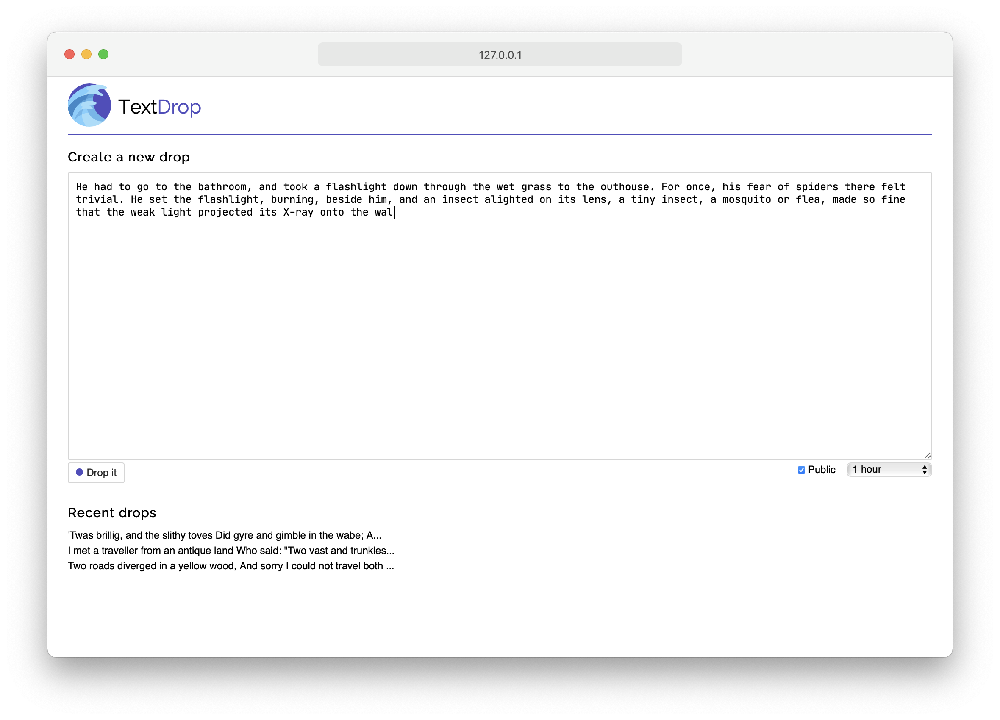
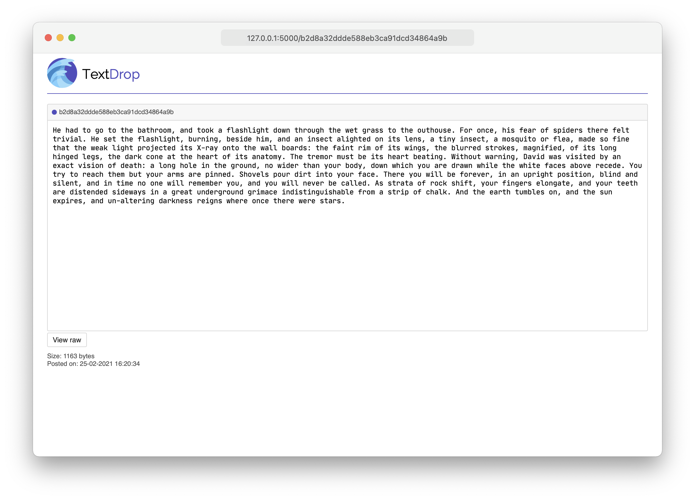

TextDrop is a Pastebin-like service built in Python and Flask. Drop some text and receive a unique URL for sharing. Drops expire after a short time.

## Live demo

A live demo of TextDrop has been deployed [here](https://erikdvlp.xyz/textdrop/).

## Screenshots

Type or paste text into the drop creator on the home page. Select whether it should be public and its expiry time.

Receive a unique page for your drop, ready for sharing.

